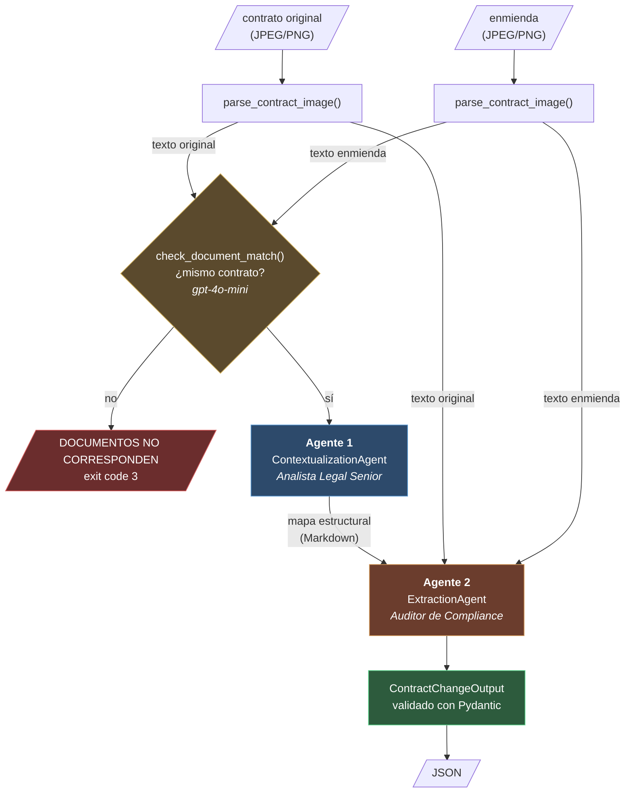

# ClauseWatch

Sistema multi-agente que compara un contrato original contra su enmienda a partir
de **imágenes escaneadas**, y devuelve un reporte estructurado de qué cláusulas
cambiaron, validado con Pydantic y trazado de punta a punta en Langfuse.

## El problema

En **LegalMove** (empresa ficticia de tecnología legal) el equipo de Compliance
pierde más de 40 horas semanales comparando contratos contra sus adendas a mano.
Es lento, propenso a error humano, y no escala.

ClauseWatch automatiza esa comparación: entran dos imágenes, sale un JSON que los
sistemas de la empresa pueden procesar.

---

## Arquitectura



**La flecha que importa** es la que va del Agente 1 al Agente 2. El Agente 2 no
recibe solo los dos textos: recibe además el mapa estructural que armó el Agente 1.
Eso es el *handoff*, y es lo que hace que sean dos agentes colaborando y no dos
programas corriendo uno después del otro.

El rombo entre el parsing y el Agente 1 **no es un tercer agente**: no analiza
cambios, solo decide si tiene sentido analizarlos (ver
[Chequeo de correspondencia](#chequeo-de-correspondencia-antes-de-los-agentes)).

### Por qué dos agentes y no uno

Cada agente tiene **una** responsabilidad, y el prompt de cada uno se lo prohíbe
invadir la del otro:

| | Agente 1 | Agente 2 |
|---|---|---|
| Rol | Analista Legal Senior | Auditor Legal de Compliance |
| Pregunta que responde | *¿qué secciones existen y cómo se corresponden?* | *¿qué cambió exactamente?* |
| Salida | Markdown (tabla de alineación) | JSON validado con Pydantic |
| Prohibición explícita en su prompt | **no puede extraer cambios** | no puede reportar cláusulas idénticas |

El prompt del Agente 1 incluye una regla negativa con ejemplo:

> *"DO NOT extract, describe, or evaluate specific clause changes (for example, do
> NOT state 'the price increased from X to Y')… You are building a structural
> roadmap for an auditor, NOT performing the audit yourself."*

Sin esa regla, el Agente 1 haría el trabajo del Agente 2 y la arquitectura de dos
agentes sería en realidad una de uno con un paso duplicado.

---

## Los 5 pasos

| # | Paso | Dónde |
|---|---|---|
| 1 | **Parsing multimodal** — validación, encoding base64 y llamada a GPT-4o Vision. Corre dos veces, una por documento | `src/image_parser.py` |
| — | **Chequeo de correspondencia** — corta si los dos documentos no son el mismo contrato. No lo pide la consigna | `src/document_match.py` |
| 2 | **Contextualización** — mapa de alineación estructural entre ambos documentos | `src/agents/contextualization_agent.py` |
| 3 | **Extracción** — identifica y clasifica cada cambio: adiciones, eliminaciones, modificaciones | `src/agents/extraction_agent.py` |
| 4 | **Validación Pydantic** — `ContractChangeOutput` vía structured outputs, con `model_validate()` de respaldo | `src/models.py` |
| 5 | **Trazabilidad** — span raíz `contract-analysis` con cinco hijos | `src/main.py` |

---

## Estructura del proyecto

```
src/
├── main.py                              entry point, CLI y orquestación
├── image_parser.py                      Paso 1
├── document_match.py                    chequeo de correspondencia
├── parse_cache.py                       registro de transcripciones (caché del Paso 1)
├── models.py                            ContractChangeOutput, DocumentMatchVerdict
├── config.py                            parámetros de los modelos
├── prompts/                             los 4 system prompts, uno por .txt
│   └── __init__.py                      load_prompt()
└── agents/
    ├── contextualization_agent.py       Agente 1
    └── extraction_agent.py              Agente 2

data/test_contracts/                     3 pares + 2 casos de correspondencia + ground truth
data/parsed_contracts/                   registro local de transcripciones (gitignoreado)
docs/prompts/                            historial versionado de los prompts
tests/                                   tests del registro (unittest)
```

Las dependencias entre módulos van **en una sola dirección**:

```
                                main.py
                      (CLI + orquestación + Langfuse)
                                   │
     ┌───────────────┬─────────────┼─────────────────┬────────────────┐
     ▼               ▼             ▼                 ▼                ▼
image_parser  document_match  contextualization_  extraction_     models.py
    .py           .py            agent.py           agent.py          ▲
     │               │             │                 │                │
     └───────────────┴──────┬──────┴─────────────────┴────────────────┘
                            ▼                    ▼
                        config.py         prompts/load_prompt()
                 (constantes, sin lógica)   (lee los .txt)
```

**Los dos agentes no se conocen entre sí.** Solo `main.py` conoce a todos, y por
eso es el único lugar donde se decide el orden de ejecución y qué hacer con el
veredicto del chequeo. `config.py` es una hoja sin lógica (solo importa
`pathlib`): lo consumen los cuatro módulos que instancian un modelo, y cada uno
carga su prompt con `load_prompt()`. `parse_cache.py` depende de `config.py` y de
`image_parser.py` (la validación y el prompt que entran en la clave), y lo usa
solo `main.py`. Cada módulo que llama a un modelo tiene su propio bloque
`if __name__ == "__main__"`; `parse_cache.py` se prueba con `tests/`.

Todo lo que viaja entre etapas es `str`, menos el veredicto del chequeo
(`DocumentMatchVerdict`) y la salida final. Ningún módulo
intermedio expone tipos de LangChain: `parse_contract_image()` devuelve
`response.text`, no un `AIMessage`. Cambiar de framework tocaría un archivo.

---

## Setup

**Requisitos:** Python ≥ 3.12 y [uv](https://docs.astral.sh/uv/).

```bash
git clone git@github.com:pabloler21/ClauseWatch.git
cd ClauseWatch
uv sync
```

`uv sync` lee `pyproject.toml` y `uv.lock` e instala las versiones exactas.

**Variables de entorno:**

```bash
cp .env.example .env
```

Y completar:

| Variable | Para qué | Dónde se obtiene |
|---|---|---|
| `OPENAI_API_KEY` | GPT-4o Vision y los dos agentes | platform.openai.com |
| `LANGFUSE_PUBLIC_KEY` | trazabilidad | Langfuse → Settings → API Keys |
| `LANGFUSE_SECRET_KEY` | trazabilidad | ídem |
| `LANGFUSE_BASE_URL` | región de Langfuse | `https://us.cloud.langfuse.com` (US) |

`.env` está en `.gitignore` y nunca se commitea. Ninguna clave aparece en el
código: LangChain toma `OPENAI_API_KEY` de `os.environ` por su cuenta, y el
`CallbackHandler` de Langfuse resuelve sus credenciales igual.

---

## Uso

```bash
uv run python src/main.py <contrato_original> <enmienda>
```

Ejemplo:

```bash
uv run python src/main.py \
  data/test_contracts/documento_1_original.jpg \
  data/test_contracts/documento_1_enmienda.jpg
```

`uv run python src/main.py --help` lista los argumentos. Los códigos de salida:

| Código | Cuándo |
|---|---|
| `0` | análisis completo, JSON en `stdout` |
| `1` | error: archivo inexistente, formato no soportado, imagen vacía, truncamiento, API |
| `2` | argumentos mal pasados (lo pone `argparse`) |
| `3` | los dos documentos no son el mismo contrato: `[DOCUMENTOS NO CORRESPONDEN]` y el motivo |

Si el chequeo rechaza un par que sabés que es válido, `--skip-match-check` lo
saltea. Queda registrado en la metadata del span raíz.

```bash
uv run python src/main.py \
  data/test_contracts/documento_4_original.jpg \
  data/test_contracts/documento_1_enmienda.jpg
# [DOCUMENTOS NO CORRESPONDEN] Los contratos son distintos y no se pueden comparar.
# Motivo: ... uno es un Acuerdo de Confidencialidad y el otro es un Contrato de
# Licencia de Software, con fechas de celebración distintas.
```

**Registro de transcripciones.** Cada imagen parseada se guarda en
`data/parsed_contracts/`. Si comparás el mismo original contra varias enmiendas,
a partir de la segunda corrida el original no vuelve a pasar por GPT-4o:

```bash
uv run python src/main.py data/test_contracts/documento_1_original.jpg data/test_contracts/documento_1_enmienda.jpg
# [1/4] Parseando imagenes con GPT-4o Vision...
#       documento_1_original.jpg: transcripcion tomada del registro.
```

`--refresh-cache` ignora lo guardado, vuelve a parsear y sobrescribe el
registro. Los tests del registro no llaman a ningún modelo:

```bash
uv run python -m unittest discover -s tests -v
```

### Salida

```json
{
  "sections_changed": [
    "1. Otorgamiento de Licencia",
    "2. Plazo",
    "3. Pago",
    "4. Soporte",
    "5. Terminación",
    "7. Protección de Datos"
  ],
  "topics_touched": [
    "Licencia y alcance",
    "Vigencia del contrato",
    "Tarifas y pagos",
    "Soporte técnico",
    "Plazos de rescisión",
    "Protección de datos"
  ],
  "summary_of_the_change": "1. Otorgamiento de Licencia: Se eliminó la palabra \"intransferible\"…, lo que constituye una eliminación.\n1. Otorgamiento de Licencia: Se modificó el uso permitido del software…\n\n2. Plazo: Se modificó la duración del contrato de 12 meses a 24 meses…",
  "changes": [
    {
      "section": "1. Otorgamiento de Licencia",
      "change_type": "deletion",
      "detail": "Se elimina 'e intransferible': la licencia deja de ser intransferible."
    },
    {
      "section": "1. Otorgamiento de Licencia",
      "change_type": "modification",
      "detail": "'fines internos de la empresa' → 'operaciones internas de negocio'."
    },
    {
      "section": "2. Plazo",
      "change_type": "modification",
      "detail": "La duración pasa de 12 a 24 meses."
    }
  ]
}
```

Fijate que la cláusula 1 produce **dos entradas** en `changes`: una eliminación y
una modificación dentro de la misma cláusula. `sections_changed` la lista una
sola vez.

Al final se imprime el link directo a la traza en Langfuse.

---

## Observabilidad

Cada corrida produce una traza jerárquica. Ejemplo real (par 1):

```
contract-analysis            ~26 s    ~$0.027
├── parse_original_contract
│   └── ChatOpenAI            1.286 → 253      GENERATION
├── parse_amendment_contract
│   └── ChatOpenAI            1.286 → 293      GENERATION
├── document_match_check      2-3 s   ~$0.0002
│   └── RunnableSequence                       CHAIN
│       ├── ChatOpenAI       ~1.100 → ~110     GENERATION  gpt-4o-mini
│       └── RunnableLambda                     parser Pydantic
├── contextualization_agent
│   └── ChatOpenAI              854 → 413      GENERATION
└── extraction_agent
    └── RunnableSequence                       CHAIN
        ├── ChatOpenAI        2.285 → 590      GENERATION
        └── RunnableLambda                     parser Pydantic
```

Si el chequeo rechaza el par, la traza termina en `document_match_check`: el
span raíz queda en `ERROR` y los agentes no aparecen, porque no se ejecutaron.
Si el chequeo mismo falla (red, timeout), su span queda en `WARNING` y el
análisis sigue.

Cada span registra input, output, latencia y errores. Los `GENERATION` agregan
modelo, tokens, costo y los parámetros de la llamada (`temperature: 0`,
`max_completion_tokens: 4000`).

### Por qué hacen falta dos mecanismos

La instrumentación combina dos cosas distintas, y **ninguna de las dos alcanza sola**:

| | Qué aporta | Qué no puede |
|---|---|---|
| `@observe(name=...)` <br/>*(SDK de Langfuse)* | envuelve una función Python en un span: nombre, input, output, latencia, errores. Crea la **jerarquía** | no sabe nada de LLMs: no puede reportar tokens ni costo |
| `CallbackHandler()` <br/>*(integración LangChain)* | modelo, tokens de prompt y completion, costo, parámetros | no conoce la estructura del pipeline |

Sin `@observe` habría cuatro trazas planas sin árbol. Sin `CallbackHandler`
habría jerarquía sin tokens ni costo. El `CallbackHandler` no recibe ningún
`parent_id`: se engancha al span de OpenTelemetry activo, que es el que abrió el
`@observe` correspondiente.

`lf_client.flush()` está en un bloque `finally` para que **las corridas fallidas
también se tracen** — que es justo cuando más se necesitan.

---

## Decisiones técnicas

### `uv` + `uv.lock` en vez de `requirements.txt`

`uv.lock` fija el árbol completo de dependencias, incluidas las transitivas, cosa
que un `requirements.txt` escrito a mano no hace. El `requirements.txt` del repo
es **derivado**, no la fuente de verdad, y se regenera con:

```bash
uv export --format requirements.txt --no-emit-project --no-hashes -o requirements.txt
```

### El resultado va a `stdout`, todo lo demás a `stderr`

El JSON es lo único que se escribe en `stdout`. El progreso, los encabezados, los
errores y el link a Langfuse van a `stderr`. Eso hace que la salida sea
componible:

```bash
uv run python src/main.py original.jpg enmienda.jpg > reporte.json
```

`reporte.json` queda con JSON puro y parseable, y el progreso se sigue viendo en
la terminal.

### `stdout` se fuerza a UTF-8

```python
sys.stdout.reconfigure(encoding="utf-8")
```

Sin esa línea, al redirigir la salida en Windows Python usa la codepage de la
consola (cp1252) y el JSON con acentos **deja de ser UTF-8 válido**:
`UnicodeDecodeError: 'utf-8' codec can't decode byte 0xf3`. El archivo se ve bien
en la terminal y revienta en cualquier sistema que lo lea como UTF-8, que es el
default en todos lados. Se detectó redirigiendo la salida a un archivo y
volviéndolo a parsear.

### Llamadas directas al modelo en vez de `create_agent`

Ninguno de los dos "agentes" tiene herramientas. `create_agent` construye un loop
ReAct — pensar, llamar tool, observar, repetir — y **sin tools ese loop nunca
itera**: sería una llamada al modelo con overhead de más. Lo que hay son dos
llamadas especializadas por rol: el Agente 1 es un `invoke()` directo sobre el
modelo, y el Agente 2 es la cadena modelo + parser que arma
`with_structured_output()` (por eso en Langfuse aparece como `RunnableSequence`).
Que se llamen "agentes" es la nomenclatura de la consigna, no una obligación de
usar ese constructor.

### Bloques multimodales estándar, no el formato de OpenAI

```python
{"type": "image", "base64": encoded, "mime_type": mime_type}
```

El formato `{"type": "image_url", "image_url": {"url": "data:image/jpeg;base64,…"}}`
que aparece en la mayoría de los tutoriales es el **provider-native** de OpenAI:
funciona, pero ata el código al proveedor. El estándar de LangChain no.

### El Agente 1 devuelve Markdown, no JSON

El consumidor de esa salida es **otro LLM**, no un programa. Forzar JSON costaría
tokens de schema sin ganar nada. La consigna lo permite explícitamente.

### Los nombres de span se deciden en el orquestador

`parse_contract_image()` corre dos veces y los spans tienen que llamarse
`parse_original_contract` y `parse_amendment_contract`. Se resuelve con dos
wrappers de una línea en `main.py`, cada uno con su `@observe(name=...)`.
`image_parser.py` no sabe cuál de los dos documentos está procesando y no tiene
por qué saberlo.

### `encode_image_to_base64()` está separada por observabilidad

No es estética: si esa función estuviera instrumentada, el output del span sería
un string base64 de más de 1 MB, guardado en cada corrida. La separación existe
para que Langfuse solo vea la llamada al modelo.

### Dos capas de validación: el schema y Pydantic

El Paso 3 pide distinguir adiciones, eliminaciones y modificaciones. Si esa
distinción vive solo en la prosa de `summary_of_the_change`, un sistema que
quiera filtrar por tipo tiene que parsear castellano — y el modelo puede escribir
"se eliminó", "se suprimió" o "desaparece" para la misma cosa.

Por eso `ContractChangeOutput` suma un cuarto campo a los tres que fija la
consigna:

```python
change_type: Literal["addition", "deletion", "modification"]
```

`Literal` se traduce a un `enum` en el JSON Schema, y ahí pasan dos cosas
distintas: **OpenAI no puede generar un cuarto valor** (la generación está
restringida, no es que lo intente y falle), y **Pydantic lo valida igual** como
red de seguridad.

Pero el schema garantiza los tipos de cada campo, **no que dos campos sean
coherentes entre sí**: nada impide que el modelo liste seis secciones en
`sections_changed` y detalle cinco en `changes`. Ese hueco lo cubre un
`@model_validator`:

```python
@model_validator(mode="after")
def sections_must_match_changes(self) -> "ContractChangeOutput":
    if {c.section for c in self.changes} != set(self.sections_changed):
        raise ValueError("Inconsistencia interna entre los campos de salida…")
    return self
```

Sin él, el bloque `except ValidationError` del agente prácticamente nunca se
ejecutaría, porque structured outputs ya garantiza los tipos. Con él, la
validación de Pydantic chequea algo que el schema no puede.

### Los prompts viven en archivos, no en el código

Cada system prompt está en `src/prompts/<nombre>.txt` y el módulo que lo usa lo
carga al importarse con `load_prompt()`:

```python
EXTRACTION_SYSTEM_PROMPT: str = load_prompt("extraction_system_prompt")
```

El prompt es la pieza que más se itera (el de extracción va por la v4), y
separarlo permite editarlo y revisar su diff sin tocar lógica. El `.txt` contiene
exactamente lo que recibe el modelo, sin encabezados; su historial y el porqué
de cada regla están en `docs/prompts/`. La carga falla al importar si el archivo
falta o está vacío: mejor eso que una llamada a la API sin instrucciones.

### Los parámetros del modelo viven en `src/config.py`

`MODEL_NAME`, `MODEL_TEMPERATURE`, `MODEL_TIMEOUT_SECONDS` y `MODEL_MAX_TOKENS`
estaban repetidos textualmente en las tres llamadas a `init_chat_model()`.
Cambiar de modelo obligaba a editar tres archivos y a acordarse de los tres.

Las **credenciales no están ahí**, y la distinción es deliberada: `config.py` se
commitea, así que solo lleva parámetros. `OPENAI_API_KEY` y las claves de
Langfuse salen del `.env` porque son secretos, y las resuelven LangChain y el SDK
de Langfuse leyendo `os.environ` por su cuenta — el código nunca las toca.

### Chequeo de correspondencia antes de los agentes

**El problema.** Si se pasan el original de un contrato y la enmienda de otro,
el pipeline los compara igual y el Agente 2 devuelve "cambios" inventados en un
JSON que pasa la validación de Pydantic. El schema garantiza la forma, no que
comparar esos dos documentos tenga sentido.

**La solución.** `check_document_match()` recibe los dos textos ya transcriptos
y devuelve un `DocumentMatchVerdict`. Si `same_agreement` es `False`, `main.py`
corta antes de los agentes.

| Decisión | Por qué |
|---|---|
| Va **después** del parsing | decide con el texto de GPT-4o, que respeta la estructura y lee bien los nombres. Un OCR local (Tesseract) decidiría con un texto peor, y un nombre mal leído rechazaría un par válido |
| Va **antes** de los agentes | los agentes son ~57 % del costo de una corrida; un par inválido no los paga |
| Una sola pregunta: ¿**el mismo acuerdo**? | "¿mismas partes?" rechazaría las enmiendas que registran una cesión, y "mismas partes" no alcanza: dos empresas firman varios contratos |
| `bool`, no probabilidad con umbral | con 11 casos de prueba no se puede calibrar un umbral |
| `gpt-4o-mini` | acertó 11/11; cuesta ~USD 0.0002 por corrida (<1 %) y suma 2-3 s |
| Dentro del stack de la consigna | OpenAI + LangChain + Pydantic + Langfuse: ni un binario que instalar ni otro proveedor |
| No lo hace el Agente 1 | si al Agente 1 le pedís un mapa, tiende a encontrar correspondencias aunque no las haya. Un clasificador aparte es neutral y se mide solo |
| Fail-open | si el chequeo mismo falla, el análisis sigue con un aviso: es un control de apoyo, no un requisito |

El veredicto lo usa el orquestador, no el módulo que lo produce:
`document_match.py` devuelve el veredicto y `main.py` decide cortar. Es el mismo
criterio que los nombres de los spans.

**Validación.** La matriz de 11 casos de `data/test_contracts/README.md` incluye
dos casos difíciles hechos a propósito: un NDA entre **las mismas partes** del
par 1 (tiene que rechazarse) y una enmienda del par 1 donde una parte **cede** su
posición (tiene que aceptarse). Resultado: 11/11. Detalle en
[`docs/prompts/document_match_system_prompt.md`](docs/prompts/document_match_system_prompt.md).

### Registro de transcripciones: caché por hash, no base vectorial

**El problema.** Comparar un contrato contra N enmiendas pagaba N veces el
parsing del mismo original, que es la llamada más lenta del pipeline (~7-9 s).

**La solución.** `src/parse_cache.py` guarda cada transcripción en un JSON cuyo
nombre es `sha256(sha256(imagen) | modelo | sha256(prompt))`. Antes de llamar a
GPT-4o, el span de parsing busca esa clave; si existe, devuelve el texto
guardado y marca `parse_cache: hit` en su metadata.

| Decisión | Por qué |
|---|---|
| Hash exacto, **no** base vectorial | una base vectorial busca por similitud sobre el *texto*: para consultarla habría que parsear primero, que es justo lo que se quiere evitar. Y una enmienda se parece mucho a su original, así que un acierto por similitud podría devolver el documento equivocado sin error visible |
| Modelo y prompt dentro de la clave | cambiar cualquiera de los dos cambia la transcripción; sin ellos, editar el prompt devolvería texto viejo |
| Un JSON por entrada | se inspecciona abriendo un archivo, y guarda la procedencia: archivo de origen, modelo, hash del prompt y fecha |
| Escritura a `.tmp` + `replace()` | si el proceso muere a mitad del guardado no queda una entrada a medio escribir |
| Fail-open | una entrada corrupta se re-parsea y sobrescribe; un fallo al escribir avisa y el análisis sigue |
| Solo el parsing | el chequeo de correspondencia y los agentes dependen del **par**, no de un documento |

**Medido sobre el par 1** (misma corrida, antes y después): de 23 s a 14 s, y de
USD 0.0300 a 0.0189. En la segunda traza los spans de parsing no tienen
generación hija. El ahorro del costo es aproximado: OpenAI cachea prompts
repetidos y eso también abarata a los agentes en una corrida seguida.

**Fase 2, no implementada:** una base vectorial sí sirve para otro problema,
*"llega una enmienda suelta, ¿a cuál contrato registrado corresponde?"*. Los
registros de `data/parsed_contracts/` serían su materia prima. Diseño en
[`docs/superpowers/specs/2026-09-26-parse-cache-design.md`](docs/superpowers/specs/2026-09-26-parse-cache-design.md).

### Errores tipados por capa

`main.py` captura cinco excepciones distintas, de la más específica a la más
genérica, y cada una mapea a una etapa del pipeline:

| Excepción | Origen | Mensaje | Exit |
|---|---|---|---|
| `DocumentMismatchError` | el chequeo determinó que no es el mismo contrato | `[DOCUMENTOS NO CORRESPONDEN]` | `3` |
| `FileNotFoundError` | la imagen no existe | `[ERROR DE ARCHIVO]` | `1` |
| `ValueError` | formato, tamaño o archivo vacío | `[ERROR DE VALIDACION]` | `1` |
| `RuntimeError` | truncamiento por tokens, o `ValidationError` de Pydantic | `[ERROR DE EJECUCION]` | `1` |
| `Exception` | red, API caída, 401 | `[ERROR INESPERADO]` | `1` |

Ningún traceback crudo llega al usuario. Todos van a `stderr`.
`DocumentMismatchError` hereda de `Exception` y no de `ValueError` a propósito:
si no, el `except ValueError` la mostraría como un error de la imagen.

### Truncamiento silencioso tratado como error

Si el modelo choca contra `max_tokens` no lanza excepción: devuelve medio contrato
con `finish_reason == "length"`. Sin ese chequeo, el Agente 2 vería que faltan las
últimas cláusulas y reportaría *"se eliminaron las cláusulas 5, 6 y 7"* — una
alucinación con apariencia de análisis correcto. Por eso se convierte en
`RuntimeError`.

Con `with_structured_output()` (Agente 2 y chequeo de correspondencia) el
truncamiento no llega como `finish_reason`: el SDK de OpenAI no puede parsear un
JSON cortado y lanza `LengthFinishReasonError`. Se verificó forzando
`max_tokens=30`, y ese módulo la convierte en el mismo `RuntimeError` con la
causa y el remedio.

---

## Validación contra ground truth

`data/test_contracts/README.md` analiza los tres pares **cláusula por cláusula**,
escrito leyendo las imágenes a mano **antes** de correr ningún modelo. Sin eso no
hay forma de distinguir "el pipeline funciona" de "el pipeline devolvió algo
verosímil": un LLM siempre devuelve algo que *parece* un análisis de contrato.

### Un fallo real encontrado y corregido midiendo

La primera versión del prompt del Agente 2 acertaba la clasificación gruesa pero
**perdía la única eliminación de todo el set**. En el par 1, cláusula 1:

| Original | Enmienda |
|---|---|
| licencia no exclusiva **e intransferible**… **únicamente** para fines internos de la empresa | licencia no exclusiva… para operaciones internas de negocio |

Son tres cambios. El prompt v1 reportaba solo la reformulación —el cosmético— y
perdía la caída de `e intransferible`, que es el jurídicamente más grave: sin esa
palabra, el Licenciatario puede ceder la licencia a un tercero.

**Diagnóstico.** No era el parsing (la transcripción conserva `e intransferible`,
la numeración y los montos sin normalizar) ni el Agente 1 (tiene prohibido
extraer cambios). Era el prompt del Agente 2: su instrucción decía *"for each
affected **clause**"*, definida a nivel cláusula y no a nivel cambio. Una vez que
el modelo abría el ítem "1. Otorgamiento de Licencia" y lo etiquetaba, el ítem
quedaba cerrado.

**Resultado de las tres versiones**, medido sobre los tres pares:

| | v1 | v2 | v3 |
|---|---|---|---|
| Detecta `intransferible` | ❌ | ✅ | ✅ |
| Cláusula 1 del par 1 como dos findings separados | ❌ | ❌ | ✅ |
| Clasificación adición vs modificación intra-cláusula | — | 2/3 | **3/3** |
| Falsos positivos en cláusulas idénticas | 0 | 0 | 0 |
| Costo por corrida | $0.0257 | $0.0256 | $0.0262 |

El historial completo, con el texto de cada versión, el motivo del cambio y los
tokens medidos, está en
[`docs/prompts/extraction_system_prompt.md`](docs/prompts/extraction_system_prompt.md).

**Nota metodológica:** el ejemplo del prompt v2 usa `irrevocable e incondicional`,
no `intransferible`. Si el prompt nombrara la palabra que el test busca, el test
mediría "¿sigue una instrucción literal?" en vez de "¿detecta eliminaciones?".

---

## Limitaciones conocidas

**Ningún par del set elimina una cláusula entera.** Los tres documentos enmendados
conservan todas las cláusulas del original; la única eliminación es *interna*
(`e intransferible`, par 1). La clasificación de eliminaciones se demuestra a
nivel de texto, no de cláusula completa.

**`changes` y `summary_of_the_change` dicen lo mismo dos veces.** La misma
información se emite en prosa y estructurada, lo que cuesta un 80 % más de tokens
de salida. No se puede eliminar la redundancia porque la consigna fija
`summary_of_the_change` como campo obligatorio.

**`temperature=0` no es del todo determinista.** Reduce la varianza, no la
elimina: corridas idénticas producen redacciones levemente distintas. Lo estable
es el contenido — las mismas secciones y los mismos valores.

**El chequeo de correspondencia se validó con 11 casos, en una sola corrida.**
11/11 es un resultado, no una tasa de error. Hay casos sin probar: dos contratos
del mismo tipo entre las mismas partes con fechas distintas, o una enmienda que
no cita al original de ninguna forma. Ante un falso rechazo existe
`--skip-match-check`.

**El registro reconoce archivos, no documentos.** Dos escaneos del mismo papel
tienen bytes distintos y no comparten entrada: se parsean dos veces. Tampoco
tiene expiración ni límite de tamaño.

**Los parámetros del modelo se cambian editando `src/config.py`.** Están
centralizados y documentados, pero no son configurables desde afuera: probar otro
modelo requiere editar el archivo, no pasar un flag ni una variable de entorno.

---

## Documentación adicional

| Archivo | Contenido |
|---|---|
| [`data/test_contracts/README.md`](data/test_contracts/README.md) | ground truth de los 3 pares, cláusula por cláusula, y la matriz de correspondencia |
| [`docs/prompts/`](docs/prompts/) | historial versionado de los 4 system prompts, con mediciones |

---

## Stack

| Componente | Uso |
|---|---|
| OpenAI GPT-4o (Vision) | parsing multimodal y los dos agentes |
| OpenAI GPT-4o-mini | chequeo de correspondencia |
| LangChain | orquestación de los agentes y structured outputs |
| Pydantic | validación del output final |
| Langfuse | trazabilidad jerárquica del workflow |
| Python 3.12 + python-dotenv | base y variables de entorno |
| uv | gestión de dependencias y entorno |
